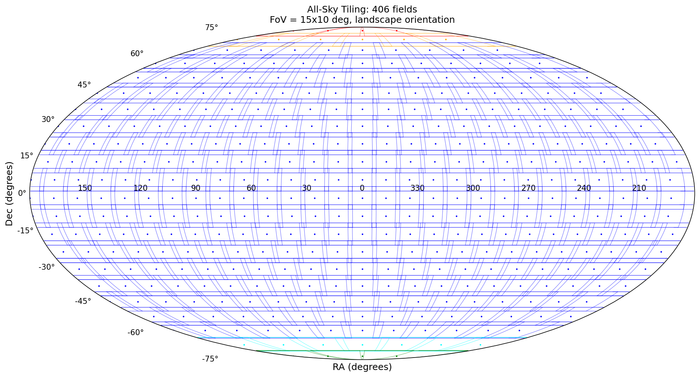
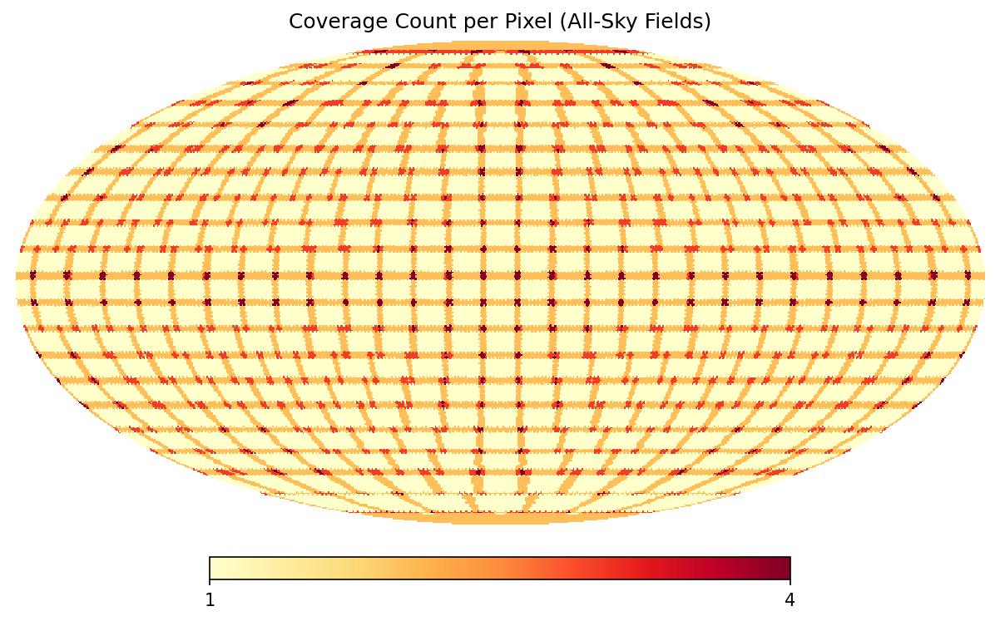

# All-Sky Imaging Survey Tiling

`tiles.py` generates a rectangular, overlapping set of imaging fields covering
the full celestial sphere. It exports the field centers in a CSV format suitable
for import into the N.I.N.A. Target Scheduler and produces plots showing the
tiling geometry and resulting sky coverage.

The example configuration and tiling data included in this repository correspond
to a full-frame sensor camera attached to a 135 mm lens. This setup uses a
15° × 10° landscape field of view with 2° overlap between adjacent fields.

## What the script does

The script:

- Builds an all-sky grid of rectangular fields in right ascension and
  declination.
- Adjusts right-ascension spacing by declination to maintain continuous sky
  coverage.
- Uses dedicated polar fields and transition rings to handle the geometry near
  the celestial poles.
- Assigns each field a name based on the IAU constellation containing its center,
  such as `Cep-01` or `Cas-03`.
- Optionally filters fields by declination, Galactic latitude, or SFD V-band
  absorption. Absorption data are not loaded or calculated unless an absorption
  limit is configured.
- Optionally splits the target list into low- and high-Galactic-latitude
  subsamples. The enabled example treats fields with |b| < 10° as low latitude,
  while extending the low-latitude region to |b| < 20° within 30° of the Galactic
  center.
- Calculates an NSIDE 64 HEALPix coverage map and reports minimum, maximum, and
  mean coverage.

The included configuration generates 406 fields: 83 in the low-Galactic-latitude
subsample and 323 in the high-Galactic-latitude subsample.

## Example tiling



## Example coverage map



## Output files

Running the script creates:

- `survey_targets.csv` — complete N.I.N.A. Target Scheduler target list.
- `survey_targets_low_gal_lat.csv` — Galactic disk and bulge subsample.
- `survey_targets_high_gal_lat.csv` — remaining high-latitude fields.
- `allsky_tiling.png` — all-sky field layout.
- `coverage_map.png` — HEALPix coverage-count map.

The CSV columns are `Name`, `Ra`, `Dec`, `Rotation`, and `ROI`. Coordinates are
written as J2000/ICRS sexagesimal right ascension and declination.

## Requirements

- Python 3
- NumPy
- Astropy
- Healpy
- Matplotlib
- `mwdust` and its SFD map data, only when an absorption filter is enabled

Install the standard dependencies with:

```bash
python3 -m pip install numpy astropy healpy matplotlib
```

## Usage

Run:

```bash
python3 tiles.py
```

Configuration constants are defined near the bottom of `tiles.py`. Set
`MIN_DEC`, `MIN_GAL_LAT`, `MAX_GAL_LAT`, or `MIN_AV` to numeric values to enable
the corresponding filters. Leave them as `None` for unrestricted all-sky
generation. Set `SPLIT_BY_GALACTIC_LAT` to control whether the two Galactic
latitude subsample files are written.
